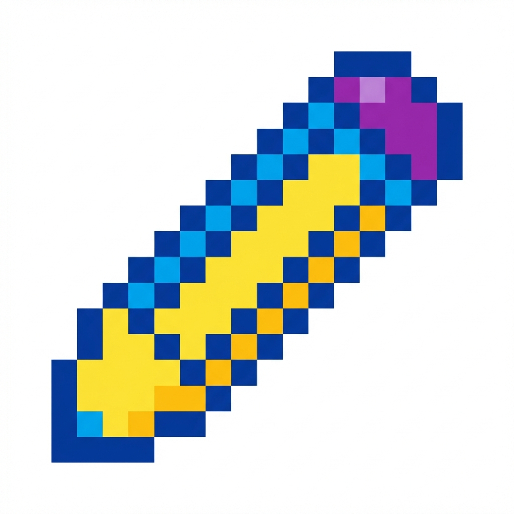
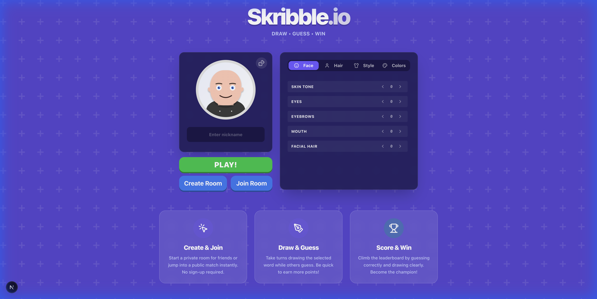
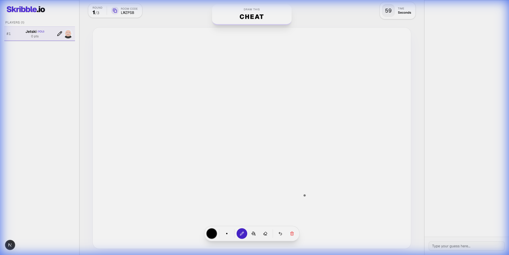

<div align="center">

  

  # Skribble.io

  **The Next-Gen Real-Time Multiplayer Drawing & Guessing Game**

  [](https://nextjs.org/)
  [](https://socket.io/)
  [](https://www.typescriptlang.org/)
  [](https://tailwindcss.com/)
  [](https://opensource.org/licenses/MIT)

  <br />

  

  <br />
  <br />

  Draw your masterpiece, guess the secret word, and compete with friends in real-time! Skribble.io is a modern reimplementation of the classic Pictionary game, built for speed, responsiveness, and fun.

  [**Play Demo**](https://skribble-io-demo.vercel.app/) · [**Report Bug**](https://github.com/your-username/skribble-io/issues) · [**Request Feature**](https://github.com/your-username/skribble-io/issues)

</div>

<br />

---

## 📸 Screenshots

<div align="center">
  
</div>

<br />

---

## 🎨 Features

- **Real-Time Multiplayer**: Seamless synchronization using Socket.io for instant drawing and chat updates.
- **Interactive Canvas**: Smooth drawing experience with multiple tools (pen, eraser, fill bucket), stroke smoothing, and undo/redo support.
- **Custom Avatars**: Comprehensive avatar creator with billions of unique combinations (face, hair, style, colors).
- **Responsive Design**: Fully optimized for desktop, tablet, and mobile play.
- **Anti-Cheat System**: Integrated OCR (Optical Character Recognition) to prevent players from writing the word instead of drawing it.
- **Game Modes**: Private rooms for friends and public matchmaking for quick play.
- **Robust Connection**: Automatic reconnection handling with grace periods to save your spot if you disconnect.
- **Modern UI**: Clean, glassmorphism-inspired interface with dark mode support.

---

## 🛠️ Tech Stack

- **Frontend**: [Next.js 14](https://nextjs.org/) (App Router), [React](https://react.dev/), [Tailwind CSS](https://tailwindcss.com/), [Framer Motion](https://www.framer.com/motion/)
- **Backend / Realtime**: [Node.js](https://nodejs.org/), [Socket.io](https://socket.io/), [Express](https://expressjs.com/)
- **Utilities**: [Tesseract.js](https://tesseract.projectnaptha.com/) (OCR), [Lucide React](https://lucide.dev/) (Icons), [Zustand](https://docs.pmnd.rs/zustand) (State Management - *if used*), [Canvas Confetti](https://www.npmjs.com/package/canvas-confetti)

---

## 🚀 Getting Started

Follow these steps to get a local copy up and running.

### Prerequisites

- Node.js (v18 or higher)
- npm or yarn

### Installation

1. **Clone the repository**
   ```bash
   git clone https://github.com/your-username/skribble-io.git
   cd skribble-io
   ```

2. **Install dependencies**
   ```bash
   npm install
   # or
   yarn install
   ```

3. **Run the development server**
   ```bash
   npm run dev
   # or
   yarn dev
   ```

4. **Open your browser**
   Navigate to `http://localhost:3000`. The app will automatically reload if you change any of the source files.

---

## 🤝 Contributing

Contributions are what make the open source community such an amazing place to learn, inspire, and create. Any contributions you make are **greatly appreciated**.

1. Fork the Project
2. Create your Feature Branch (`git checkout -b feature/AmazingFeature`)
3. Commit your Changes (`git commit -m 'Add some AmazingFeature'`)
4. Push to the Branch (`git push origin feature/AmazingFeature`)
5. Open a Pull Request

---

## 📄 License

Distributed under the MIT License. See `LICENSE` for more information.

---

<div align="center">
  <small>Built with ❤️ by Anurag Verma</small>
</div>
